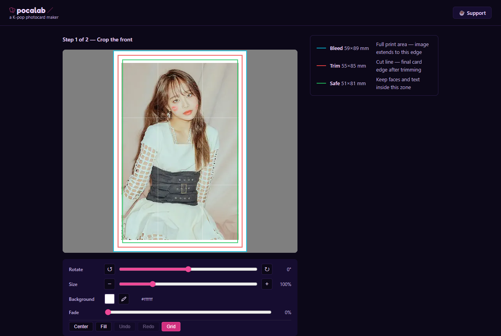
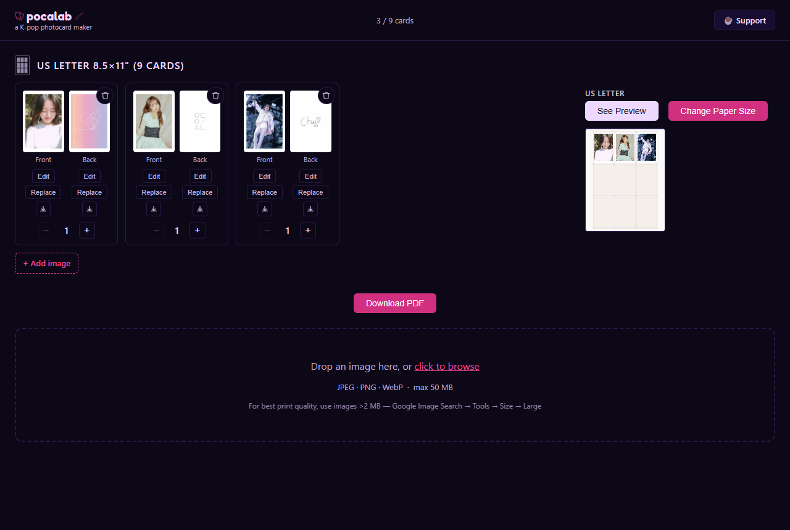

# pocalab — a K-pop photocard maker

[](https://github.com/mattlau95/pocalab/actions/workflows/ci.yml)

Print K-pop photocards at exact size from your browser. Upload a photo, crop it to the official card spec, build a deck, and download a double-sided PDF that comes out of a home printer at 55 × 85 mm with the back registered to the front.

**Live:** [pocalab.app](https://pocalab.app) · no account, no backend, nothing to install.



## Why it exists

Photocards are the 55 × 85 mm trading cards packaged with K-pop albums. Fans collect them, trade them, and make their own. Making your own meant a Canva template with bleed zones and cut lines, and a manual loop for every batch: crop each image by eye, drag it into the guides, repeat for the back, repeat for every card, export, print, check the duplex alignment, sometimes reprint. Nine double-sided cards took about 45 minutes, and the process never got faster.

pocalab does the mechanical part deterministically. The same nine cards now take about 12 minutes, and because the back is registered to the front automatically, cards print straight onto cardstock instead of being printed on two sheets and glued. The full story, with the numbers, is in the [devlog introduction](docs/DEVLOG.md#introduction).

## How it works

1. **Crop.** Drop in a photo. The editor shows three nested guides: bleed (59 × 89 mm, the image fills to here), trim (55 × 85 mm, where you cut) and safe (51 × 81 mm, keep faces and text inside). Rotate, zoom, pan with the mouse or arrow keys, pick a background colour, and confirm. The crop is rasterised to exactly 697 × 1051 px, which is 300 DPI at bleed size.
2. **Deck.** Add a back for the card, or reuse one back for the whole deck. Set copy counts. Pick a paper size: US Letter or A4 at nine cards a sheet, or 4 × 6 and 5 × 7 photo paper at two to four cards a sheet. The sheet preview updates live.
3. **Print.** Download a two-page PDF. Page one is the fronts with crop marks; page two is the backs, mirrored for a long-edge duplex flip so each back lands behind its front.



## The hard part

A browser can lay images on a page easily. Getting a card to come out of a printer at exactly 55 mm, with its back in the right place, is the actual problem.

- **Three unit systems have to agree.** The crop canvas works in pixels at 300 DPI, the layout maths works in millimetres, and the PDF works in points at 72 per inch. `src/utils/dimensions.ts` owns the millimetre-to-pixel conversion and the card constants; the layout and PDF modules convert millimetres to points. Rounding drift anywhere in that chain shows up as a card that is a hair too small.
- **Rotation-aware rasterisation.** `src/utils/cropImage.ts` draws the source onto a rotated intermediate canvas, clips the crop rectangle to the image bounds, composites it onto the chosen background at the exact output size, and applies the optional fade. Zooming out below 100 % is allowed, so the background shows around the photo instead of stretching it.
- **n-up geometry with a validity check.** `src/utils/printLayout.ts` centres an n-up grid on any sheet size and reports whether the margins can actually hold the bleed. The photo-paper presets that fit are the ones that pass.
- **Duplex mirroring.** For a long-edge flip the back page is x-mirrored: `back.x = sheetWidth − front.x − cardWidth` (`src/utils/printPdf.ts`, `src/utils/layout.ts`). Get that wrong and every back is offset.

## What I built and what I wired together

| Mine | Library |
|---|---|
| Crop rasterisation at 300 DPI with rotation, background and bleed compositing (`src/utils/cropImage.ts`) | `react-easy-crop` provides the drag and pinch gesture surface inside the crop frame |
| Sheet layout geometry, validity check and crop marks (`src/utils/printLayout.ts`, `src/utils/layout.ts`) | `pdf-lib` provides page, image and line primitives; it is loaded lazily on first export |
| Duplex mirroring and PDF assembly (`src/utils/printPdf.ts`, `src/utils/pdf.ts`) | React 19, TypeScript and Vite |
| The step state machine that runs crop → back → deck → edit flows (`src/App.tsx`) | |
| Project model, reducer, IndexedDB persistence and migration from localStorage (`src/hooks/useProject.ts`, `src/utils/projectStore.ts`, `src/models/`) | |
| Crop editor UX: undo/redo, keyboard panning, eyedropper, fill-to-bleed, low-resolution warning (`src/components/CropEditor.tsx`) | |
| Live SVG sheet preview (`src/components/SheetPreview.tsx`) | |
| Three rounds of WCAG 2.2 AA work, documented in the audits below | |

## Decisions

- **Client-side only.** No accounts, no onboarding, no infrastructure; the ceiling is browser storage and the Canvas API. The project lives in IndexedDB because a deck of 300 DPI cards is well past the localStorage quota.
- **pdf-lib over jsPDF.** jsPDF's strength is HTML-to-PDF, which is irrelevant here; pdf-lib is TypeScript-native and works in exact point coordinates.
- **300 DPI floor, 2 mm bleed.** The card is rasterised at 697 × 1051 px and the editor warns when the source cannot supply that many pixels, so soft prints are a known trade-off rather than a surprise.
- **Long-edge duplex.** Backs are mirrored for the flip that home printers default to; the PDF says so in its margin.
- **Lazy PDF chunk.** pdf-lib is 175 KB gzipped and only needed at export, so it is a dynamic import; initial load is 80 KB gzipped.
- **Shared back.** One back can serve the whole deck, which removed the single most repetitive step of the manual workflow.

Each decision has a dated entry in the [devlog](docs/DEVLOG.md).

## Print spec

| Zone | Size | Purpose |
|---|---|---|
| Bleed | 59 × 89 mm (697 × 1051 px at 300 DPI) | Image fills to here so a slightly off cut has no white edge |
| Trim | 55 × 85 mm | The cut line; the finished card |
| Safe | 51 × 81 mm | Keep faces and text inside |

Presets: US Letter and A4 (3 × 3, 9 cards), 4 × 6 (2-up), 5 × 7 (2-up, 3-up, 4-up). All output is 300 DPI.

## Stack

React 19 · TypeScript · Vite · pdf-lib · react-easy-crop · plain CSS with custom properties (dark theme by default, light theme kept for a future toggle) · Vercel.

## Project map

```
src/
├── App.tsx                # step state machine: crop → back → deck → edit
├── components/
│   ├── CropEditor.tsx     # guides, undo/redo, keyboard pan, eyedropper, fill
│   ├── DeckCard.tsx       # front/back thumbnails, copies, edit/replace/move
│   ├── ImageUpload.tsx    # drop zone with type/size validation
│   ├── SheetPreview.tsx   # live SVG preview of the sheet layout
│   └── Modal.tsx
├── hooks/
│   ├── useProject.ts      # reducer, hydration, persistence, migration
│   └── useBeforeUnload.ts
├── models/                # Card, Deck, Project, print presets
└── utils/
    ├── projectStore.ts    # IndexedDB read/write of the whole project
    ├── dimensions.ts      # mm ↔ px, card constants (single source of truth)
    ├── cropImage.ts       # 300 DPI rasterisation with rotation and bleed
    ├── printLayout.ts     # n-up geometry and validity check
    ├── printPdf.ts        # photo-paper PDFs, duplex mirror, crop marks
    ├── layout.ts, pdf.ts  # Letter/A4 3×3 PDF
tests/                     # node:test unit tests; e2e/ drives the built app with Playwright
docs/
├── DEVLOG.md              # build log, session by session
├── audits/                # UX / a11y audit reports, dated
└── ...                    # plans and notes
```

## Run it

```bash
npm install
npm run dev        # http://localhost:5173
npm run build      # type-check + production build to dist/
npm run lint
npm test           # unit tests: print layout geometry and PDF output
npm run test:e2e   # browser tests against the production build (run npm run build first)
```

Deployed on Vercel: every push to `main` goes to production, and other branches get preview URLs. See [docs/deploy.md](docs/deploy.md).

## Accessibility

WCAG 2.2 AA is the bar. The repo keeps its audit reports (`docs/audits/`) and the fixes they led to: keyboard-operable crop editor and upload zones, visible focus that is never hidden behind the sticky header or the mobile action bar, AA contrast in the dark and light themes, `prefers-reduced-motion`, live regions for the card count and export state, and a skip link.

## More

- [Devlog](docs/DEVLOG.md), including [why exact print size is not trivial](docs/DEVLOG.md#the-catch--why-its-not-trivial) and the [measured outcome](docs/DEVLOG.md#from-45-minutes-to-12).
- [Case study on matthewclau.com](https://www.matthewclau.com/projects/pocalab.html).

Built by [Matthew C. Lau](https://github.com/mattlau95).
